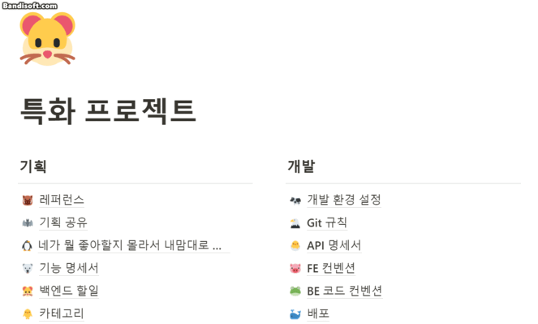

# Sub-Pjt 2 Readme

## 1. 서비스 개요

### 1.1 서비스 설명

**개요**
- 한줄 소개 : 지루한 일상을 새롭게 큐레이팅 해주고 새로운 자신을 찾게 해주는 서비스
- 서비스 명: Hello, Stranger

**타겟**
-  매일 똑같은 하루에 지친 사람들
- 새롭고 신선한 자극을 원하는 사람들
- 새로운 지역으로 여행, 이사를 가 그 지역에 대해 아는 것이 많이 없는 사람들

### 1.2 기획배경

- Hello, Stranger 서비스는 반복되는 `일상에서 무료함`을 느끼고, `새로운 경험`을 원하는 사람들이 많다는 문제로부터 시작했습니다.
    - 어떤 사람들은 일상에서 벗어나려면 어떤일을 해야할지 모르기도 합니다. 실패가 불안해 매일 똑같은 음식점, 똑같은 활동만 하다보니, 내 주위에는 어떤 음식점, 활동이 있는지 알 수 없습니다.
    - 또, 어떤 사람들은 새로운 경험을 하기 위해 검색을 하고, 계획을 세우려고 노력하지만, 혹시나 돈과 시간을 사용하였는데 나와 맞지 않을까 고민하며 일상으로 돌아가기도 합니다.
- 저희는 반복되는 일상에서 지루함을 느끼는 사람들에게, `지루한 일상을 새롭게 큐레이팅 해주고 새로운 자신을 찾게 해주는 서비스`를 구상하였습니다.

## 2. 기술스택
### 2.1 Hadoop Cluster

- 저희는 하둡의 더 많은 기능을 활용하기 위해 자체적으로 하둡 클러스터를 구성했습니다. 저희의 하둡 클러스터는 하나의 마스터와 두 개의 워커로 구성되었으며, 도커를 이용해 EC2 안에 구현했습니다.

### 2.2 Hello, world! Algorithm

- 컨텐츠 기반 필터링과 유저 기반 협업 필터링을 합친 `하이브리드 추천 시스템`을 사용하였습니다.
    - `컨텐츠 기반 필터링`을 위해 우선 카테고리에 임의의 태그를 추가했습니다. 유저가 선호하는 `카테고리와 유사한 다른 카테고리들의 추천 확률을 낮게` 설정해 추천을 진행했습니다.이 과정을 통해 협업 필터링 기반 추천에서 발생할 수 있는 콜드 스타트 문제를 해결하고자 했습니다.
    - 또한 축적되는 유저 데이터 기반으로 추천 기능을 고도화하기 위해 `유저 기반 협업 필터링`을 적용했습니다.저희는 비슷한 유저들끼리는 선호 대상도 유사할 것이라는 가정을 했습니다. 따라서 추천 서비스를 이용하는 유저와 유사한 유저들의 선호 카테고리를 분석해 추천 확률을 낮게 설정했습니다.

### 2.3 Spark ML

- 추천 알고리즘을 구현하기 위해 스파크 머신러닝 라이브러리를 활용했습니다. 스파크 머신러닝 라이브러리는 스퍼크 컴포넌트로, 접근성이 높고 확장성이 양호해 파이프 라인 개발에 도움을 줍니다. 그 중 ALS 알고리즘을 적용해 유저 기반 협업 필터링을 구현했습니다.

### 2.4 Progressive Web Apps

- 저희 서비스는 Progressive Web Application,(PWA)입니다. PWA는 반응형 웹 개발 방식을 통해 모바일 앱과 유사한 모습과 기능을 띄는 서비스를 말합니다. 저희는 이를 활용해 모바일 앱과 같은 보다 쾌적한 ui를 구현할 수 있었으며, 업데이트 또한 마켓을 거치지 않아도 돼 훨씬 수월하게 진행할 수 있었습니다.

## 3. 자세한 서비스 설명

### 3.1 로그인 페이지

Hello Stranger에 접속하면 가장 먼저 보이는 페이지 입니다. Spotify계정으로 Hello,Stranger를 이용할 수 있습니다.  
Login with Spotify버튼을 눌러 회원가입 및 로그인을 진행할 수 있습니다.

### 3.2 서비스 가이드라인

Hello, Stranger에 처음 접속하면 사용자의 원할한 취향조사를 위한 가이드라인을 제시합니다.

### 3.3 취향조사

처음 회원가입을 하면 사용자에게 적절한 하루를 추천하기 위한 정보를 얻기 위해 취향조사를 실시합니다. 취향조사는 음악, 음식, 활동을 대상으로 진행됩니다.

가장 먼저 음악에 대한 취향조사를 실시합니다. 5개의 음악을 제시하며 사용자는 목록에 있는 음악을 들어볼 수 있습니다. 음악 목록은 좌/우로 스와이프해 확인할 수 있습니다. 사용자는 목록에 있는 음악을 듣고 좋아요, 싫어요, 혹은 선택을 하지 않을 수 있습니다. 단, 1개 이상의 음악에 좋아요 및 싫어요를 표시해야합니다.

음악 선택 이후 사용자는 음식/활동을 대상으로 취향조사를 실시할 수 있습니다. 음식/활동은 5가지의 항목을 제시하며 사용자는 목록을 좌우로 스와이프하여 항목을 확인할 수 있습니다. 사용자는 목록을 보고 좋아요, 싫어요, 혹은 선택을 하지 않을 수 있습니다. 단, 1개 이상의 항목에 좋아요 및 싫어요를 표시해야합니다.

활동까지 취향조사를 마쳤다면 메인페이지로 이동해 본격적으로 Hello,Stranger를 이용할 수 있습니다.

### 3.4 메인 페이지

로그인을 하면 메인페이지로 이동해서 현재 위치에 대한 정보를 가져옵니다.

검색 기준 위치, 검색 범위는 변경이 가능합니다.  
주소를 클릭해서 원하는 지역을 검색 후 클릭하면 검색 기준 위치가 해당 지역으로 변경됩니다.  
슬라이더를 드래그해서 1km ~ 3km 사이의 검색 범위를 0.5km 단위로 선택할 수 있습니다.

검색 기준 위치가 변경 됐을 때 홈버튼을 누르면 현재 위치로 다시 설정할 수 있습니다.

### 3.5 추천 페이지

### a. 음악 추천

추천 시작 버튼을 눌러서 음악, 음식, 활동에 대한 목록을 받아올 수 있습니다.

음악 페이지에서는 시드가 될 음악을 하나만 선택해야 합니다.  
결과 페이지에서 해당 음악을 바탕으로 새로운 플레이리스트를 생성해줍니다.  
시드가 될 음악을 선택하지 않으면 음식 목록, 활동 목록으로 넘어갈 수 없습니다.  
마음에 들지 않는 음악에 싫어요 표시를 하면 다음 추천에 반영이 됩니다. 싫어요 갯수에는 제한이 없습니다.

스포티파이에서 제공하는 음악에 한해서 미리듣기를 할 수 있습니다.  
또한, 각 추천 목록에 대해서 새로고침을 최대 2번까지 할 수 있습니다.

###  b. 음식, 활동 추천

카테고리를 클릭하면 해당 카테고리에 해당하는 주변 가게 목록을 볼 수 있습니다.  
가게 목록 중 하나를 선택하면 지도에서 위치를 확인할 수 있습니다.

지도에 나타나는 마커를 누르면 마커에 해당하는 가게 정보를 볼 수 있으며, 하단의 가게 정보를 클릭하면 연락처, 영업 시간, 리뷰, 별정 등의 상세 정보를 볼 수 있습니다.

뒤로 가기를 눌러서 카테고리 목록으로 돌아갈 수 있습니다.  
만약 카테고리에 대한 가게가 주변에 없다면 가게 목록이 나타나지 않습니다.  
음식, 활동 카테고리의 좋아요, 싫어요에는 제한이 없습니다.

활동 목록도 음식 목록과 동일합니다.

### 3.6 추천 결과 페이지

활동 추천 목록에서 완료를 누르면 추천 결과 페이지로 이동합니다.

왼쪽 메뉴를 클릭해서 음식 가게만 보거나 활동 가게만 보도록 할 수 있습니다.

선택했던 시드 음악을 바탕으로 생성된 플레이리스트를 볼 수 있습니다.  
이 플레이리스트는 사용자의 스포티파이 플레이리스트에서도 확인할 수 있습니다.

음식, 활동 결과는 카테고리별로 가게 목록을 볼 수 있습니다.  
이때, 이전 추천 페이지에서 싫어요를 표시했던 카테고리는 나타나지 않습니다.  
지도에 있는 마커를 누르면 가게 정보가 간략하게 나타납니다.

일정 저장은 추천 결과에서 마음에 드는 가게를 선택해서 플레이리스트와 함께 저장할 수 있는 기능입니다.  
일정 저장을 누르면 음식, 활동 카테고리 및 가게 목록이 나타나고 각 카테고리에서 가게 하나씩 선택해서 일정명을 입력하면 일정을 저장할 수 있습니다.  
저장한 일정은 다시보기 페이지에서 확인할 수 있습니다.

홈버튼을 누르면 메인 페이지로 돌아갈 수 있습니다.  
메인 페이지에서 일정을 저장한 후에 2일 이내로 평가하지 않은 일정이 있을 때 상단에 알림창이 나타납니다.

### 3.7 동네분석

하단에 있는 동네분석 탭을 선택하면 현재 우리동네에 가장 많거나 가장 적은 음식/활동 카테고리를 즐길 수 있는 가게들이 지도위에 마커로 표시됩니다.
마커를 선택하면 해당 가게의 간단한 정보를 확인할 수 있습니다. 선택된 마커는 모양이 변하며 선택됐다는 것을 표시합니다.
우리 동네의 기준은 음식은 법정동 주소 기준, 활동은 시군구 주소 기준입니다.

지도 좌측에 있는 음식/활동 버튼을 누르면 상세정보를 제공하는 메뉴가 나옵니다. 메뉴에는 최다/최소 카테고리의 종류가 표시되고 해당 카테고리를 즐길 수 있는 가게들의 리스트를 제공합니다.  
리스트에 제공된 상호명을 선택하면 해당 가게의 상세정보를 확인할 수 있습니다. 상세정보로는 상호명을 포함한 사진, 별점, 전화번호, 주소, 영업시간, 리뷰등을 제공합니다.

### 3.8 다른유저 일정

하단에 있는 다른일정 탭을 선택하면 다른 사용자가 선택한 음식점/활동장소를 확인할 수 있습니다. 해당 장소들은 지도위에 마커로 표시됩니다. 선택된 마커는 모양이 변하며 선택됐다는 것을 표시합니다.  
마커를 선택하면 해당 가게의 간단한 정보를 확인할 수 있습니다.

지도 좌측에 있는 음식/활동 버튼을 누르면 다른 사용자가 일정을 구성할 때 선택했던 음식/활동과 관련된 가게들의 상세정보를 확인할 수 있습니다. 상세정보로는 상호명을 포함한 사진, 별점, 전화번호, 주소, 영업시간, 리뷰등을 제공합니다.

## 4. 프로젝트 진행

### 4.1 Git

- `Master`, `BE`, `FE`, `Develop`, `Deploy`로 큰 기능의 브랜치를 생성한 후 각자 맡은 기능에 맞게 `feature` 브랜치를 만들어 사용하였습니다. 작업을 완료한 기능은 각각 `BE` 와 `FE` 브랜치에 merge 후 최종적으로 `deploy` 브랜치로 merge하여 배포했습니다.

- Git 컨벤션을 정하여 `[#S07P22D104-191] feat: 음식 상세 조회 API` 와 같이 통일하여 작성하도록 노력했습니다.

### 4.2 Jira

기능 명세서와 간트차트를 작성하면서 각자 맡은 업무들을 정하였으며, 해당 업무들을 백로그에 등록하였습니다. 프로젝트를 진행하면서 추가적으로 생긴 업무나 담당자가 변경되어야 할 업무들은 상황에 맞춰 변경하여 `현재 어떤 업무를 누가 하고 있는지` 명확하게 확인할 수 있도록 노력했습니다.

- Epic은 가장 큰 단위인 `[개발][BE] 회원관리`, `[데이터] 데이터 전처리`등으로 구성하였습니다.
- Story는 에픽에 포함되는 기능단위로 나누 등록하였습니다. 회원관리에 포함되는 `회원정보`, `취향조사`와 같은 항목들로 구성하였습니다.
- Task는 기능을 구현하기 위해 실제로 해야할 작은 업무 단위로 작성하였습니다. `Entity 생성`, `Request, Reponse 객체 생성`등이 이에 해당됩니다.
- 링크를 이용하여 해당 Task가 어떤 Stroy와 Epic에 엮여있는지 구별하기 쉽도록 노력했습니다.

### 4.3 Notion

기획부터 스크럼까지 모두가 공유해야할 자료 및 링크는 노션에 정리하였습니다. 특히 API명세서, 코드 컨벤션과 같이 여러번 다시 봐야하는 정보들은 특히 노션에 공유함으로써 불필요한 커뮤니케이션을 줄일 수 있도록 노력했습니다.

## 5. 배포

## 6. 설계

### 6.1 UI/UX

- 디자인

- 와이어 프레임

- 목업

피그마를 통해 추가적인 페이지, 페이지 내/외 동작, 기타 화면 기획 중 회의 내역 등을 확인하실 수 있습니다.

### 6.2 ERD

### 6.3 Architecture

## 7. 소감

- 이병헌 : React 활용법에 대해서 숙지할 수 있었고, scss 와 bem을 사용해 체계적으로 css를 적용할 수 있었습니다. pwa 서비스를 구현했지만, 조금 더 많은 기능을 적용해보지 못한 것이 아쉬움으로 남습니다. 서비스 기획 측면에서도 다른 사례를 참고하고 사용자 관점에서 해당 서비스를 이용할 이유를 조금 더 고민해봤으면 어땠을까 하는 생각이 듭니다.
    
    팀장으로서 진행했던 첫 프로젝트였기에 앞으로도 더욱 기억에 남을 것 같습니다. 처음 접하는 내용들이 대부분이라  많은 어려움을 겪었지만, 팀원들이 포기하지 않아 끝까지 프로젝트를 완성할 수 있었습니다.
    
- 박채림 : 처음으로 경험해보는 Hadoop/Spark, 도커를 이용한 CI/CD를 해보면서 개인적인 어려움이 많았던 프로젝트였지만 팀원들 덕분에 무사히 마무리할 수 있었던것같습니다! 특히 발표 전날에 클러스터 서버가 날아가서 직접 만든 클러스터 서버를 다시 만질때는 굉장히 흥미진진했던것같습니다^^.......... 공통 때부터 같이 프로젝트를 진행해온 팀원들이라 그런지 더 재밌게 진행할 수 있었고 기억에 남을 것 같습니다. 모두들 고생했어요!!!
- 김이랑 :  나름대로 하둡 에코시스템을 이해하고 이용하면서 프로젝트를 진행할 수 있었습니다. 기술적인 고민을 조금 더 했으면 하는 아쉬움이 남기도하지만, 구현하고자 한 목표를 달성할 수 있었습니다. 로컬 환경, 제공된 클러스터 서버, 직접 만든 클러스터서버 세번에 걸쳐 작업을 진행해 터미널 창과 아주 친해진 기분이 듭니다. 프론트도 백도 다 처음 사용해보는 기술이 많아 부담스러웠을텐데 잘 마무리해서 뿌듯합니다! 다들 고생하셨습니다🥰
- 임현탁 : 리액트를 처음 접해봐서 익숙치 않았던 프로젝트였습니다. 같은 프론트엔드를 맡아 프로젝트를 진행한 인후님과 병헌님이 잘 이끌어주어 끝마칠 수 있었던 프로젝트였습니다. 백엔드 분들도 데이터 처리와 함께 진행하다 보니 많이 힘드셨을텐데 나빼고 다들 고생하신 것 같아 미안한 마음이 들고 우여곡절이 많았던 프로젝트지만 마무리를 할 수 있게 되어 굉장히 홀가분 합니다!
- 조인후 :
- 가수왕 : 이번 프로젝트에서 대부분 처음 접해보는 기술을 사용하다 보니 심적인 부담감이 심했습니다. 하지만 서로서로 멘탈케어를 해주고 기술적으로 어려움을 같이 해결하다 보니 무사히 프로젝트를 마무리 할 수 있었던 것 같습니다. 서로 알고 있던 지식을 공유하다 보니 제가 맡지 않았던 파트에 대한 이해도도 자연스럽게 올라갈 수 있어서 좋았습니다. 다들 고생하셨습니다!!!!